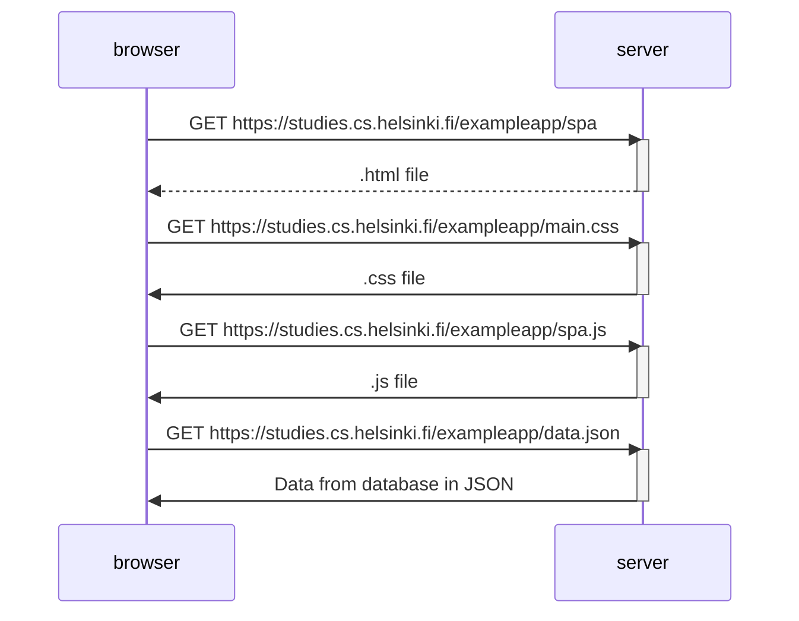

```mermaid
sequenceDiagram
    participant browser
    participant server

    %% HTML
    browser->>server: GET https://studies.cs.helsinki.fi/exampleapp/spa
    activate server
    server-->>browser: .html file
    deactivate server

    %%CSS
    browser->>server: GET https://studies.cs.helsinki.fi/exampleapp/main.css
    activate server
    server->>browser: .css file
    deactivate server

    %%JS
    browser->>server: GET https://studies.cs.helsinki.fi/exampleapp/spa.js
    activate server
    server->>browser: .js file
    deactivate server

    %%Database
    browser->>server: GET https://studies.cs.helsinki.fi/exampleapp/data.json
    activate server
    server->>browser: Data from database in JSON
    deactivate server
```